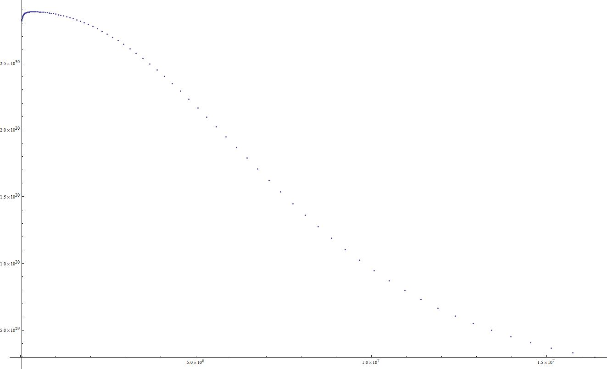

# Chandrasekhar_mass
计算钱德拉塞卡极限质量

参考自徐仁新《天体物理导论》（第一版）P142-P151（7.2-7.3）

详细推导见知乎我的知乎文章[https://zhuanlan.zhihu.com/p/337736598](https://zhuanlan.zhihu.com/p/337736598)

计算结果如下图

-----

顺便用julia练练手，julia还是挺好用的，运行速度很快，而且可以画图，一条龙服务。（虽然我用的还是PyPlot包作图。）[julia版本代码](./Chandrasekhar_mass.ipynb)
